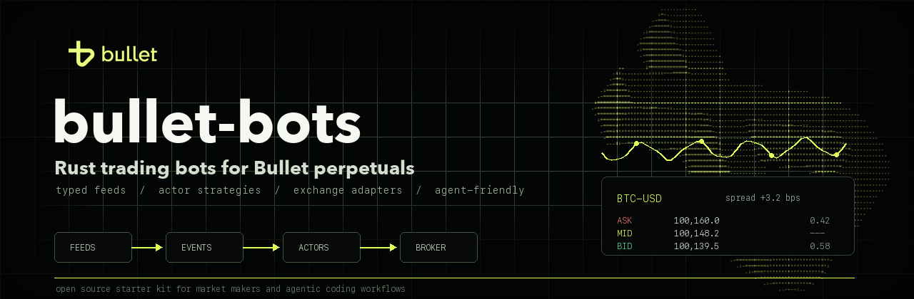

# bullet-bots

<p align="center">
  
</p>

[](https://github.com/bulletxyz/bullet-bots/actions/workflows/ci.yml)
[](LICENSE)
[](https://www.rust-lang.org)

Live-trading-capable reference framework for [Bullet](https://bullet.xyz) perpetuals and other exchanges — written in Rust, with a small typed runtime for building event-driven bots.

Ships with exchange adapters for Bullet, Hyperliquid, and Binance, plus five ready-to-run strategies you can use out of the box or extend with your own logic.

## Architecture at a glance

Strategies are **actors** that consume typed **events** (`Trade`, `BookUpdate`,
`OrderLifecycle`, `MarkPriceUpdate`, `Tick`) published by **feeds** owned by
exchange adapters. A shared **harness** wires everything together and handles
lifecycle, reconnection, and shutdown. See [AGENTS.md](AGENTS.md) for the
full architecture tour and [HACKING.md](HACKING.md) for a walkthrough of
adding your own strategy.

Key invariant: `Trade` is the only canonical source of position/PnL changes,
so double-count bugs from adapters that emit both trade and order-update
events are structurally impossible.

For an annotated component diagram, event-flow walkthrough, adapter layout
rules, and the broker contract, see [docs/ARCHITECTURE.md](docs/ARCHITECTURE.md).

## Quick start

```sh
# Build
cargo build

# Run tests
cargo nextest run

# Validate a starter config (no keys needed)
cargo run --bin bb-bot -- validate --config config/simple-mm-example.toml

# Generate a Bullet testnet key, fund it with the printed faucet curl,
# deposit into the perp margin account, then run the starter market maker.
cargo run --bin bb-bot -- keygen --network testnet
# ...run the faucet curl printed above, then deposit into the margin account:
cargo run --bin bb-bot -- deposit --network testnet --asset USDC --amount 5000
cargo run --bin bb-bot -- run --config config/simple-mm-example.toml
```

Recommended first path:

1. `keygen` — create a testnet key.
2. Fund it with the faucet command printed by `keygen`. The faucet credits your
   on-chain wallet, not your trading account. The faucet is **testnet only** —
   on mainnet you fund the wallet with real bridged/deposited assets instead.
3. `deposit` — move funds from the on-chain wallet into the perp margin account
   (e.g. `deposit --network testnet --asset USDC --amount 5000`). The asset must
   match a name in Bullet's exchangeInfo (e.g. `USDC`) and the amount is in that
   asset's units. This also initializes the trading account; without it, order
   placement fails with `user_variants not found`.
4. `observe` — collect Bullet/Binance spread data without trading.
5. `validate` — preflight the config.
6. `run` — start tiny, watch logs plus `GET /status`.
7. `flatten` — cancel and close manually if you need to clean up.

## Trading from your own wallet (recommended)

For real usage, trade with a **delegate key** rather than your main wallet key:

1. Sign in at [app.bullet.xyz](https://app.bullet.xyz) (or
   [app.testnet.bullet.xyz](https://app.testnet.bullet.xyz)) with your wallet
   (e.g. Phantom). This creates the embedded wallet that is your Bullet trading
   account.
2. Deposit collateral through the webapp UI — this initializes the trading
   account.
3. Create a delegate (see Bullet's
   [delegate setup guide](https://docs.bullet.xyz/bulletx-exchange/how-to-guide/delegate-account-setup)),
   then copy the delegate signer private key into `.env` as
   `BB_BULLET_PRIVATE_KEY`. Base58 (Phantom / delegation export), hex, and
   Solana JSON keystores (`BB_BULLET_KEY_FILE`) are all accepted.
4. For Hyperliquid, create an API wallet at
   [app.hyperliquid.xyz/API](https://app.hyperliquid.xyz/API) and copy its key
   into `.env` as `BB_HYPERLIQUID_PRIVATE_KEY_HEX`.

> **What is a delegate / API wallet?** A separate keypair authorized to trade on
> behalf of your account. It can place and cancel orders but **cannot deposit or
> withdraw**, and you can revoke it from the webapp at any time — so you trade
> without exposing your main wallet's private key. The bot resolves the
> delegate to its master account automatically; all balances and positions live
> on the master account.

Copy `.env.example` to `.env` (gitignored) to get started.

## Key management

Private keys are passed via environment variables or keystore files, not copied
into example configs. Two options:

- **Bullet key file (recommended):** generate once with `cargo run --bin bb-bot -- keygen`, then set `BB_BULLET_KEY_FILE` or add `key_file = "/path/to/id.json"` under `[exchanges.bullet]`.
- **Key string:** set `BB_BULLET_PRIVATE_KEY` (base58 or hex) /
  `BB_HYPERLIQUID_PRIVATE_KEY_HEX`, e.g. via a `.env` file (already gitignored).
  `BB_BULLET_PRIVATE_KEY_HEX` still works as an alias.

## Strategies

Start with `simple-mm`, then move down the table as you need more machinery.

| Order | Strategy | Description | Config example |
|---|---|---|---|
| 1 | [Simple MM](crates/strategies/simple-mm/README.md) | One bid/ask around mid with refresh + inventory cap | `config/simple-mm-example.toml` |
| 2 | [Grid](crates/strategies/grid/README.md) | Fixed-range level grid with anchor bias and trend filter | `config/grid-example.toml` |
| 3 | [Reference arb](crates/strategies/reference-arb/README.md) | Spread arb between Bullet and Binance perpetuals | `config/reference-arb-example.toml` |
| 4 | [Avellaneda-Stoikov](crates/strategies/avellaneda-stoikov/README.md) | Reservation-price market maker with inventory skew and multi-level ladder | `config/avellaneda-stoikov-example.toml` |
| 5 | [Funding arb](crates/strategies/funding-arb/README.md) | Cross-venue delta-neutral funding rate arb | `config/funding-arb-example.toml` |

Each README covers what the strategy does, its state machine, key design decisions, config reference, and future work.

## Writing your own strategy

1. Copy `crates/strategies/simple-mm` or create a crate in `crates/strategies/<name>/`.
2. Implement `Actor` + `EventHandler<E>` for each event type you care about.
3. Register in `bb-bot/src/main.rs` with `HarnessBuilder::wire_actor`.
4. Add an example config.

Full walkthrough: [HACKING.md](HACKING.md).

## Status API

While running, the bot exposes an HTTP status endpoint on `engine.status_port`
(default 3030, bound to `127.0.0.1`):

- `GET /health` — liveness check
- `GET /status` — uptime plus every actor's JSON snapshot keyed by name

```sh
curl localhost:3030/status
```

```jsonc
{
  "uptime_secs": 142,
  "actors": {
    "simple-mm": {
      "symbol": "BTC-USD",
      "dry_run": false,
      "net_position": "0.002",   // signed inventory (+ long / - short)
      "realized_pnl": "1.37",    // closed-trade PnL in quote units
      "total_fills": 5,          // count of Trade events applied
      "mid": "68250.5",
      "bid": { "side": "Buy",  "price": "68181.2", "client_id": "12", "order_id": "9001" },
      "ask": { "side": "Sell", "price": "68319.8", "client_id": "13", "order_id": "9002" }
    }
  }
}
```

The actor snapshot is whatever that strategy's `Actor::status()` returns, so
fields vary per strategy (the example above is `simple-mm`).

To expose on a non-loopback address (e.g. for remote monitoring), set
`engine.status_bind = "0.0.0.0:3030"` — note that the endpoint exposes
positions and PnL, so firewall accordingly.

## Troubleshooting

Common first-run errors and their fixes:

- **`user_variants not found`** on order placement — you skipped the `deposit`
  step, so the trading account was never initialized. Run:
  ```sh
  cargo run --bin bb-bot -- deposit --network testnet --asset USDC --amount 5000
  ```
- **reference-arb "refuses to run with a non-flat position"** — a prior session
  left an open position. Flatten it first:
  ```sh
  cargo run --bin bb-bot -- flatten --network testnet --symbol BTC-USD
  ```
- **Status port already in use** — two bots can't share `engine.status_port`.
  Give each running bot a unique port (the example configs use 3030–3034).

## Intentionally out of scope

The following are explicit non-goals for v1 — listing them reduces issues
and clarifies where to build extensions:

- **Backtest / replay harness** — The framework ships `Clock` / `MockBroker` /
  `ScriptedFeed` test primitives; a full fill-simulation engine is not provided.
- **Persistence / crash recovery / journal** — No event log or replay on restart.
- **Prometheus metrics** — No `/metrics` endpoint; `/status` is JSON-only.
- **Rate limiting** — Each broker manages its own rate limit; the framework has no
  built-in token-bucket or request queue.
- **Global instrument validation** — Bullet snaps tick-size / lot-size in its
  broker, but the framework does not provide a venue-independent min-notional
  or risk-budget preflight.
- **Extended `OrderType`** — `Limit`, `PostOnly`, `Market` only. No IOC, FOK, GTD,
  or `time_in_force` plumbing beyond what the adapters already need.

## Requirements

- Rust 1.85+ (edition 2024)
- `cargo +nightly fmt` for formatting (optional)

## Risk Disclaimer

This is an open-source **reference implementation** intended for educational and research purposes. It is not a commercial product and does not constitute financial or investment advice.

Automated trading strategies involve substantial financial risk. Bugs, network failures, exchange outages, adverse market conditions, and misconfiguration can all result in partial or total loss of capital. You are solely responsible for any funds you deploy using this software.

By running this software against live markets you accept that:

- The authors and contributors make no representations or warranties of any kind, express or implied, regarding the software's fitness for trading or any other purpose.
- The authors and contributors shall not be liable for any financial losses, damages, or other claims arising from the use of this software.
- Past behaviour in test or simulated environments is not indicative of future results in live markets.

The MIT licence under which this software is distributed expressly disclaims all implied warranties and limits liability to the fullest extent permitted by applicable law. See [LICENSE](LICENSE).
