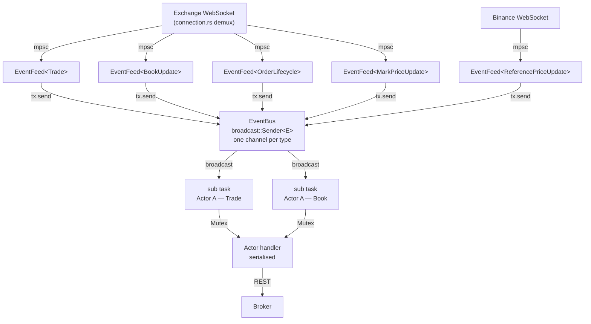
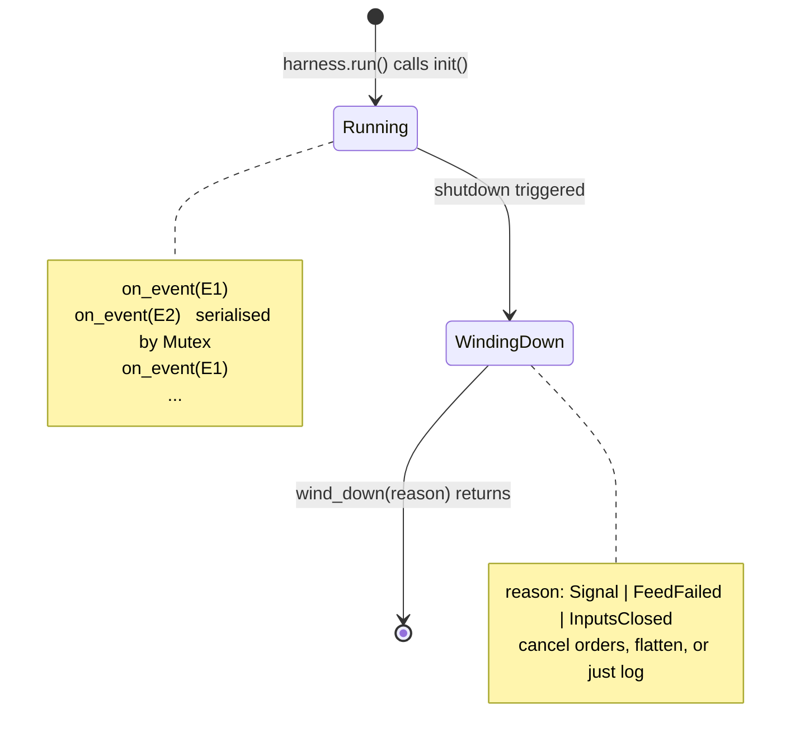
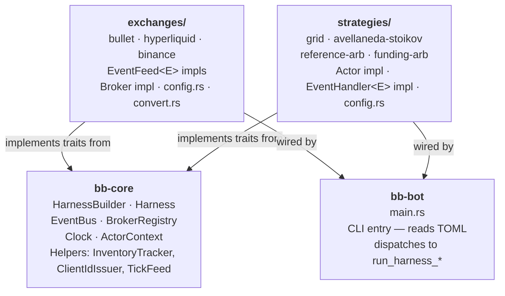
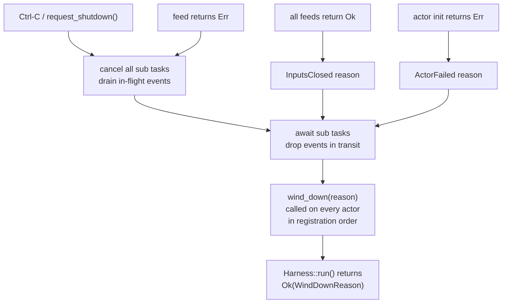
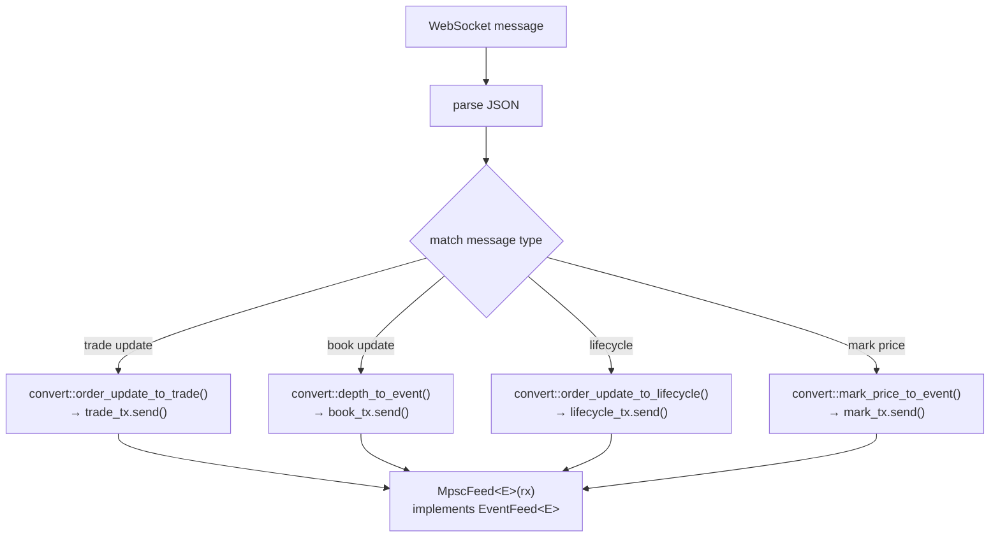
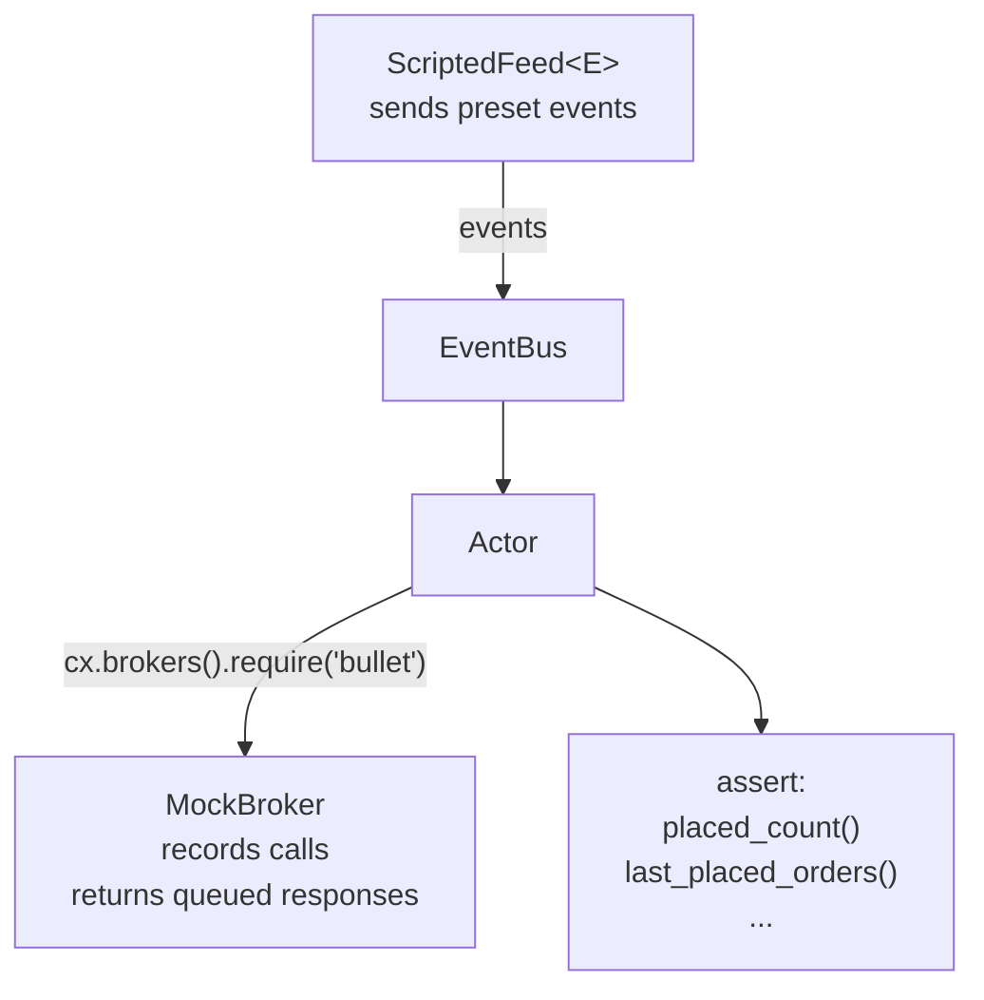

# bullet-bots — Architecture

This document describes the runtime model: how events flow from venue WebSockets
through the harness to strategy actors, and how actors place orders back through
the broker layer.

## Overview



## The three primitives

### EventFeed\<E\>

A feed owns one upstream connection and publishes events of a single type `E`.
Feeds are typed: `BulletTradeFeed` only publishes `Trade`, `BulletBookFeed`
only publishes `BookUpdate`, etc. This makes the type of data each feed
produces self-documenting and checked at compile time.

The trait is minimal:

```rust
#[async_trait]
pub trait EventFeed<E: Event>: Send + 'static {
    async fn run(self: Box<Self>, tx: EventTx<E>, cx: FeedContext) -> Result<(), BotError>;
}
```

A feed exits by returning from `run`. On clean exit, the harness records it;
once all feeds exit, it enters `InputsClosed` shutdown. On error, the harness
immediately initiates shutdown with `FeedFailed`.

### EventBus

The bus is a map of `TypeId → broadcast::Sender<Box<dyn Any>>`. One broadcast
channel per event type. When a feed sends an event the harness fans it out to
every subscriber of that type in parallel.

Actors subscribe before feeds start, so no event is ever sent to an empty bus.

### Actor

An actor holds state and implements `EventHandler<E>` for each event type it
cares about. The harness guards each actor with a `Mutex` so handler calls
never overlap — even if two different event types arrive at the same instant,
only one handler runs at a time. Internal state is therefore safe to mutate
without any additional synchronization.



`wind_down` is called with the `WindDownReason` so actors can decide: cancel
all orders on `Signal`, flatten positions on `FeedFailed`, or just log on
`InputsClosed`.

## Component diagram



## Event types and their producers

| Event                  | Canonical meaning                                  | Produced by              |
|------------------------|----------------------------------------------------|--------------------------|
| `Trade`                | Our account got a fill. Update position/PnL here.  | Bullet, Hyperliquid      |
| `OrderLifecycle`       | Order state change. Reconcile only — never PnL.    | Bullet, Hyperliquid      |
| `BookUpdate`           | Orderbook snapshot or delta.                       | Bullet, Hyperliquid      |
| `MarkPriceUpdate`      | Mark price and/or funding rate.                    | Bullet, Hyperliquid      |
| `Tick`                 | Periodic heartbeat. Drives timed strategy work.    | `TickFeed` (framework)   |
| `ReferencePriceUpdate` | External reference price (Binance microprice).     | `bb-exchange-binance`    |

**Key invariant:** `Trade` is the *only* source of position and realized-PnL
changes. `OrderLifecycle::Filled` is never used for this purpose, even though
it also signals a fill. Some adapters emit both for the same execution (HL's
`UserFills` + `OrderUpdates`); crediting both would double-count. The split is
enforced by convention in every strategy.

## Shutdown flow



## Broker contract

```
place_orders(&[NewOrder]) → Result<Vec<OrderResult>, BotError>
```

- `Err(e)` — transport / system failure. The whole call failed; no orders were
  submitted. Retryable errors (`e.is_retryable()`) may be retried by the actor;
  non-retryable errors should trigger shutdown.
- `Ok(results)` — call reached the venue. Each `OrderResult` has `success:
  bool` — `false` means venue-level rejection of that one order (e.g.,
  insufficient margin, price out of bounds). Other orders in the batch may
  have succeeded.
- `order_id: Option<String>` — `Some(id)` when the venue confirmed an ID
  synchronously; `None` when the outcome is unknown until the lifecycle stream
  confirms.

`amend_orders` defaults to sequential cancel-then-place. Bullet and (TODO) HL
override this with native atomic amend.

## Adapter layout

Every exchange adapter follows the same four-file structure:

```
connection.rs   — owns the WebSocket, demuxes into typed mpsc channels,
                  exposes a <Name>Feeds bundle of EventFeed<E> impls.
broker.rs       — implements bb_core::broker::Broker for REST (place, cancel, query).
convert.rs      — value conversions between venue wire types and bb-core types.
config.rs       — TOML-derived adapter config (auth, network, symbol).
```

The `connection.rs` demux loop pattern:



`convert.rs` is the only place that touches venue-specific field names and
wire formats. `connection.rs` just routes; `broker.rs` just calls REST.

## Testing model



For time-sensitive tests, swap `ScriptedFeed` for `MarketDataReplayFeed<E>` and
inject a `TestClock` via `HarnessBuilder::with_clock`. The feed advances the
clock to each event's timestamp before sending, so strategies see event-driven
time instead of wall-clock time.

See `crates/strategies/reference-arb/src/strategy.rs` for a full example of
the Flat → Entering → Holding → Exiting → Flat state machine driven end-to-end
through a scripted harness test.
